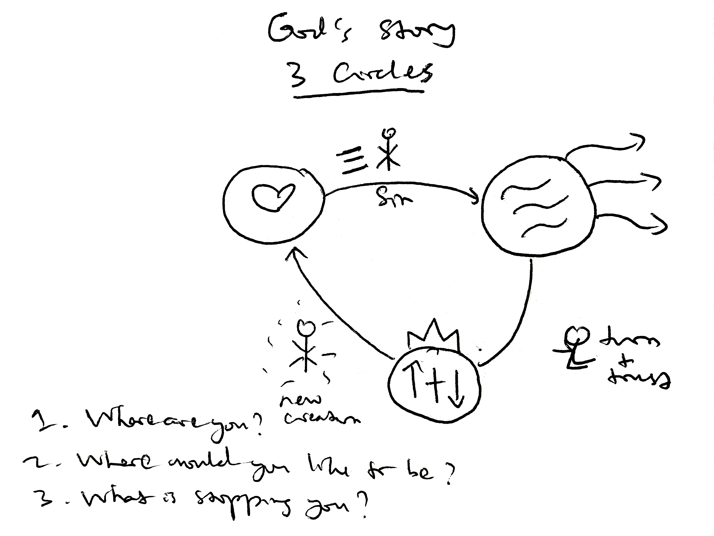

For the past two consecutive Saturdays, I have been learning how to share the hope that I have in Christ. Last Saturday, I participated in *Send Saturday*, organized by Church of the City in Manhattan. Today, I joined a half-day training led by <a href="https://www.iamsecond.com/lslabs/">Live Second Labs</a>.

You might wonder, why am I doing this?

2 Corinthians 5:17–20 says:

> Therefore, if anyone is in Christ, he is a new creation. The old has passed away; behold, the new has come. All this is from God, who through Christ reconciled us to himself and gave us the ministry of reconciliation; that is, in Christ God was reconciling the world to himself, not counting their trespasses against them, and entrusting to us the message of reconciliation. Therefore, we are ambassadors for Christ, God making his appeal through us. We implore you on behalf of Christ, be reconciled to God.

I am a new creation, and I am an ambassador of Christ. And what does an ambassador do? I'll let you answer.

The Three Circles Gospel presentation uses three circles to tell the story of the gospel. The first circle represents the good world without sin that God originally created. The second represents the broken world we live in because of sin. The third represents God's rescue plan: sending His Son, Jesus, into the world to redeem us from our sins through His substitutionary death on the cross and His resurrection three days later.

But how do all these circles connect with one another?

That was exactly what we practiced during part of the training. We went over the story again and again, hoping to be able to tell it clearly. Christians may know this story by heart, but communicating it in a way that someone who has never heard it before can understand surely takes wisdom.

Here is how I would tell the story:

If we look around us, we see so much brokenness in the world: disease, crime, poverty, broken families, and even war. But that is not how God originally designed the world.

In the beginning, God, the Creator, made the world good and without sin. He then created us, human beings, and we had a close relationship with Him. However, humanity chose to disobey and sin against God. Here, sin is anything we think, say, or do that dishonors Him. Sin caused brokenness to enter the world, and that is why we see what we see around us today.

So what do we do to escape this brokenness?

Some people might pursue success, money, or relationships, hoping that these things will fulfill their lives. Others turn to religion or spirituality, trying to earn God's favor and blessings through good works. But none of these things can ultimately rescue us from sin and the brokenness it causes.

The good news is that God loves us. He knew that we could not deal with our sin on our own, so He made a way for us to be rescued. He sent His own Son, Jesus, into the world.

Jesus lived a completely sinless life. During His lifetime, some people followed Him, while others rejected Him. He was eventually handed over to be crucified on a cross. But His death was not an accident. It was God's plan from the beginning to rescue us from our sins.

There is nothing good enough that we could do to pay for our own sins, and we deserve the judgment that sin brings. Thankfully, Jesus took our sins upon Himself on the cross and bore the judgment that we deserved. He died the death that our sins deserved, and through His death, He paid the penalty for our sins.

But that was not the end of the story.

Three days later, Jesus defeated death and rose from the grave. He is alive and now sits at the right hand of God, and He has been given all authority in heaven and on earth.

Jesus has paid the price for our sins, and salvation is a free gift. But we must personally receive this gift through repentance and faith. How? In the middle of our brokenness, what we need is to turn toward God, repent of our sins, believe that Jesus died and rose again, and surrender our lives to Him as Lord and King.

When we do that, God makes us a new creation. Our relationship with Him is restored, just as He intended from the beginning. And importantly, we have the hope of spending eternity with God.

That is the gospel.

And that is literally the story that saved my life.